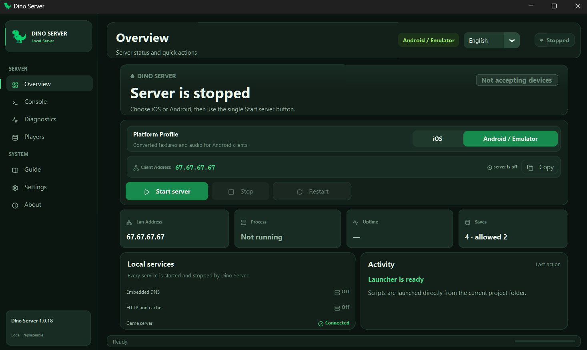

<div align="center">

# 🦖 Dino Server

### Open-source local server implementation for Jurassic Park Builder

Run a compatible client against a self-hosted Dino Server on your own local network.

**No APKs · No IPAs · No game cache · No proprietary game assets**

[](LICENSE)
[](../../releases/latest)
[](../../releases/latest)

**[Download latest release](../../releases/latest)** · **[Changelog](CHANGELOG.md)** · **[Source](.)**

</div>

---

## Overview

**Dino Server** is an independent, fan-made open-source project for local self-hosting and compatibility with **Jurassic Park Builder** clients.

It provides the server-side services and a Windows launcher used to configure and run those services on a local network. This repository contains the Dino Server source code and project-created resources.

It does **not** contain or distribute:

- Jurassic Park Builder APK files;
- Jurassic Park Builder IPA files;
- game cache files;
- original game artwork, audio, textures, models, video, or other proprietary game assets;
- modified game applications.

Users must provide any required compatible client and local client-side data themselves and are responsible for ensuring they are entitled to use those files.

Dino Server is not affiliated with, endorsed by, sponsored by, or approved by the original developers, publishers, Universal, or other rights holders.

---

## Screenshot

<div align="center">



<sub>Dino Server 1.0.18 — Overview</sub>

</div>

---

## Features

- **Local server stack** — starts and stops the services used by the local client connection.
- **Windows launcher** — a graphical interface for server controls, status, diagnostics, settings, and guidance.
- **iOS and Android / emulator profiles** — separate local configuration paths for supported client setups.
- **Save safeguards** — rolling backups, save locking, linked-device handling, and conservative recovery paths.
- **Player controls** — optional local allow-list and linked-device management.
- **Diagnostics** — local service, port, address, and connection checks from the launcher.
- **Automatic updates** — stable Windows builds are retrieved from this repository's GitHub Releases feed and verified before installation.

---

## Repository policy

Dino Server keeps source code separate from game data.

The cache directories in this repository contain placeholders only:

```text
cache_android/PLACE_CACHE_FILES_HERE.txt
cache_ios/PLACE_CACHE_FILES_HERE.txt
```

Runtime cache files are ignored by Git. Compatibility/configuration data that may originate from a local client installation is also intentionally excluded from the source repository.

See [`config/README.md`](config/README.md) for details.

---

## Getting started

### Windows release

For most users, use the prebuilt Windows package from **[GitHub Releases](../../releases/latest)**.

Extract the archive and run:

```text
DinoServer.exe
```

Published releases include SHA-256 checksum files so downloads can be verified independently.

> Windows SmartScreen may warn about unsigned community builds. Dino Server should not require you to disable Windows Defender, antivirus software, or Windows Firewall.

### Running from source

Requirements:

- Windows;
- Python 3;
- the Python packages listed in `requirements.txt`.

```bash
git clone https://github.com/LastThylacine/dino-server-releases.git
cd dino-server-releases
python -m venv .venv
```

Activate the environment in PowerShell:

```powershell
.venv\Scripts\Activate.ps1
```

Install dependencies and launch:

```bash
pip install -r requirements.txt
python -m launcher.app
```

Some runtime compatibility/configuration files are intentionally not distributed in this source repository. See [`config/README.md`](config/README.md).

---

## Project structure

```text
launcher/          Windows launcher, UI, diagnostics and update handling
jpb_server/        Core local server implementation
tools/             Maintenance and local administration utilities
assets/icons/      Launcher icons with third-party license notices
icons/             Dino Server application icons
config/            Local configuration examples and documentation
cache_android/     Empty placeholder for user-provided local data
cache_ios/         Empty placeholder for user-provided local data
docs/screenshots/  Project screenshots used by this README
```

---

## Releases and automatic updates

Stable Windows builds remain in **[GitHub Releases](../../releases)**.

The existing launcher checks this repository's latest stable release. Source-code commits to the default branch do not replace or modify previously published release assets.

When a new stable Dino Server version is published, its update package and checksum must continue to follow the format expected by the existing updater.

---

## Contributing

Contributions to the Dino Server codebase and documentation are welcome.

Before submitting a pull request, read [`CONTRIBUTING.md`](CONTRIBUTING.md). In particular, do **not** submit game applications, cache files, proprietary game assets, credentials, or private player/save data.

---

## License

Dino Server source code is licensed under the **GNU General Public License v3.0**. See [`LICENSE`](LICENSE).

Third-party components retain their respective licenses. See [`THIRD_PARTY_NOTICES.md`](THIRD_PARTY_NOTICES.md).

---

## Disclaimer

Dino Server is an independent fan-made project.

Jurassic Park Builder and related names, trademarks, artwork, characters, and other intellectual property belong to their respective rights holders. No ownership of the original game or its proprietary content is claimed by this project.

This repository does not provide the original game application or proprietary game data.

---

<div align="center">

**Local self-hosting · Compatibility · Open source**

If Dino Server is useful to you, consider starring the repository. ⭐

</div>
